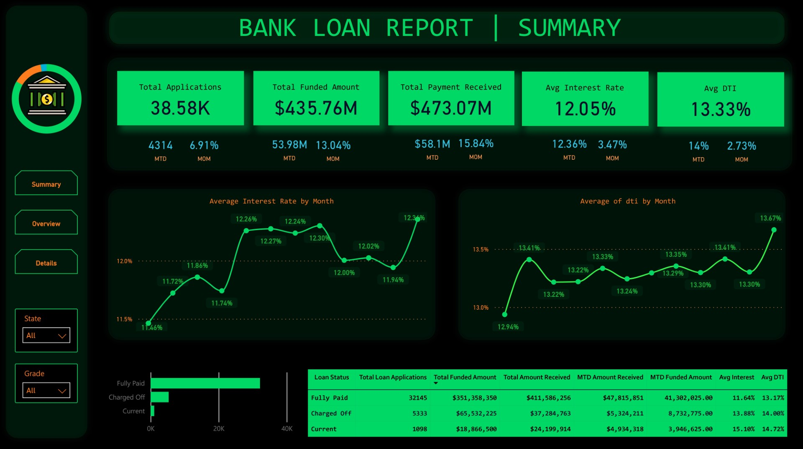
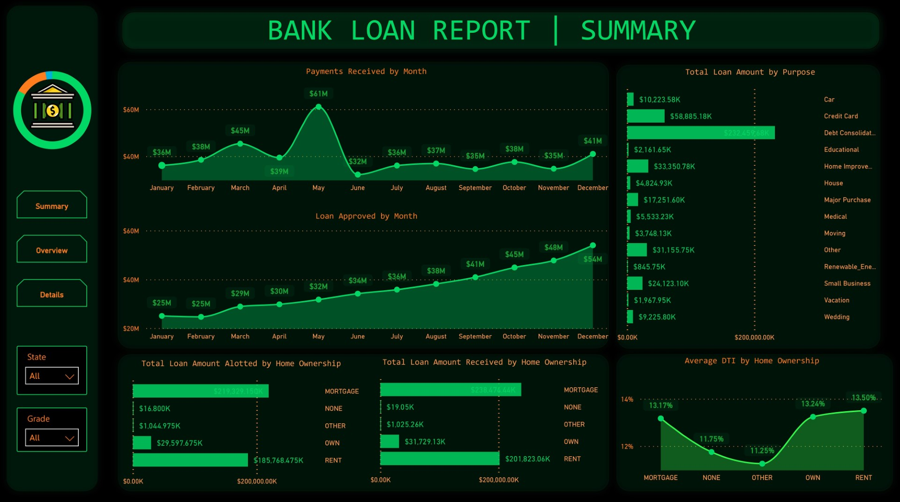
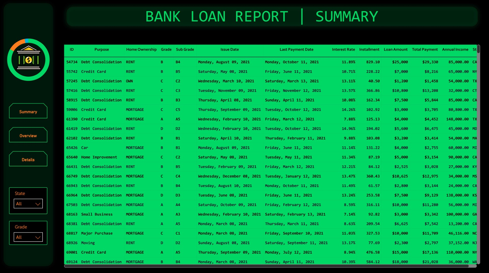

<h1 align="center"> Bank Loan Report</h1>

<!-- ABOUT THE PROJECT -->
<h2 id="about-the-project"> :pencil: About The Project</h2>

In order to monitor and assess our bank's lending activities and performance, we need to create a comprehensive Bank Loan Report. This report aims to provide insights into key loan-related metrics and their changes over time. The report will help us make data-driven decisions, track our loan portfolio's health, and identify trends that can inform our lending strategies.

<!-- Links -->
<h2 id="documentation"> :bookmark: Links</h2>

<ul>
    <li><a href="https://www.novypro.com/project/bank-loan-1f" target="_blank">Live Dashboard @NovyPro)</a></li>
    <li><a href="https://github.com/AbhijeetSrivastav/Dashboards/blob/main/Bank%20Loan/Domain%20Knowledge.pdf" target="_blank">Domain Knowledge</a></li>

<!-- Showcase -->
<h2 id="showcase"> :camera: Showcase</h2>

  <table>
    <tr>
      <td></td>
      <td></td>
    </tr>
    <tr>
      <td></td>
    </tr>
  </table>

